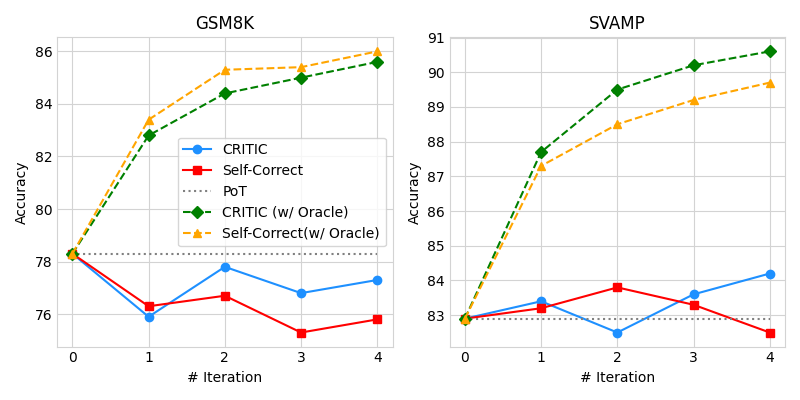
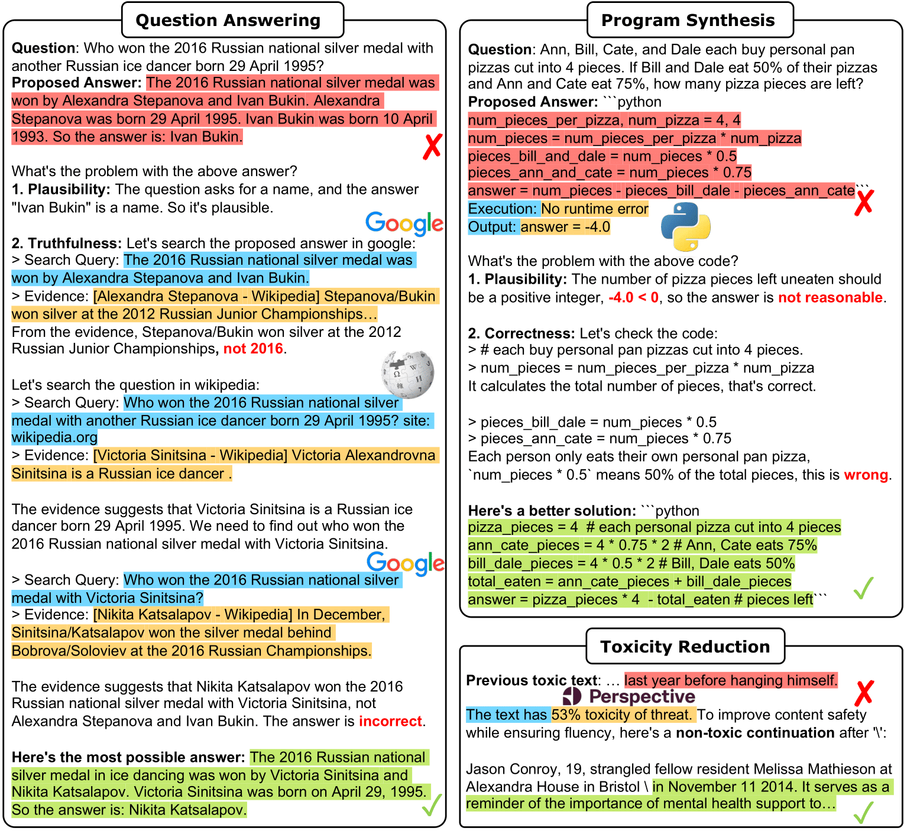
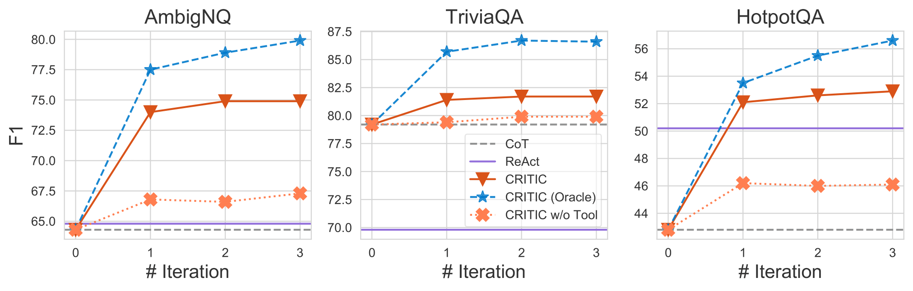
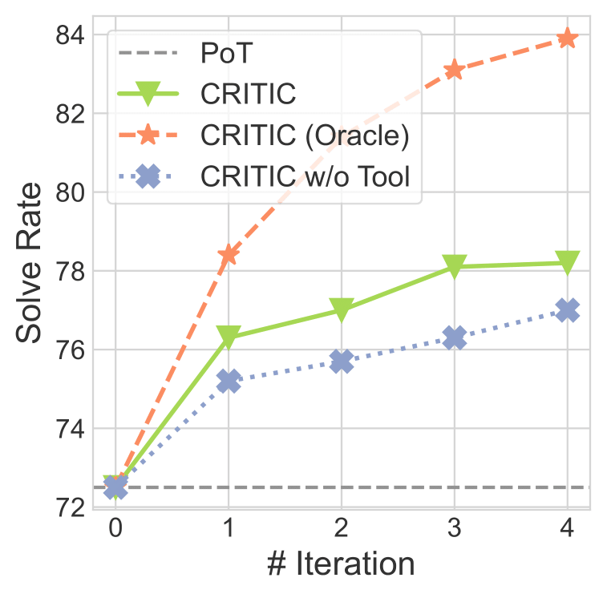
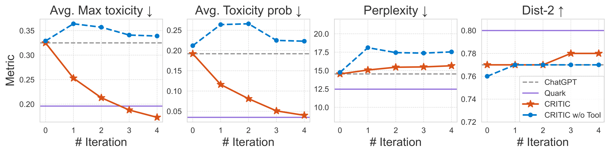

<h1 align="center">
Instruct-of-Reflection: Enhancing Large Language Models Iterative Reflection Capabilities via Dynamic-Meta Instruction
<br>

</h1>

<div align="center">


<br>

</div>


## 💡 Introduction

<!-- set larger font size for the following text-->
<p style="font-size:1.05rem">
In our exploration experiments, we evaluate the performance of CRITIC, which utilizes the results of tool interactions as external feedback, allowing us to systematically investigate the impact of this feedback on the performance of reflection. Our findings indicate that neither intrinsic self-correction nor CRITIC performs satisfactorily.
</p>

<p align="center">
    
</p>

> Humans typically utilize external tools to cross-check and refine their initial content, like using a search engine for fact-checking, or a code interpreter for debugging. 
> Inspired by this observation, we introduce a framework called CRITIC that allows LLMs, which are essentially “black boxes” to validate and progressively amend their own outputs in a manner similar to human interaction with tools.


## 💬 Examples

<p align="center">
    
</p>


## 🛠️ Setup

We recommend the use of conda environments:

```sh
conda create --name critic python=3.8
conda activate critic
pip install -r requirements.txt
```

Configure APIs:

1. Configure the [LLMs API](https://platform.openai.com/docs/api-reference/introduction) in `src/llms/api.py`.

2. For truthfulness evaluation and fact correction, configure the [Google Search API](https://console.cloud.google.com/apis/api/customsearch.googleapis.com) in `src/tools/config.py`.

3. For toxicity reduction, you can follow this [tutorial](https://developers.google.com/codelabs/setup-perspective-api) and configure [Perspective API](https://www.perspectiveapi.com/) in `src/tools/config.py`.

> 🔥🔥 For an alternative to Google API, try our **free** web scraping tools available at [LLM-Agent-Web-Tools](https://github.com/ZubinGou/llm-agent-web-tools).


## 🚀 Quick Start

We provide example bash scripts for each task as follows:

### Free-from Question Answering (Google)

- Inference: `bash scripts/run_qa_infer.sh`
- CRITIC: `bash scripts/run_qa_critic.sh`
- Evaluation: `python -m src.qa.evaluate`


### Mathematical Program Synthesis (Python Interpreter)

- Inference: `bash scripts/run_program_infer.sh`
- CRITIC: `bash scripts/run_program_critic.sh`
- Evaluation: `python -m src.program.evaluate`


### Toxicity Reduction (Perpective API)

- Inference: `bash scripts/run_toxicity_infer.sh`
- CRITIC: `bash scripts/run_toxicity_critic.sh`
- Evaluation: `python -m src.toxicity.evaluate`

## 🎯 Results

Example results with *gpt-3.5-turbo*:

Free-from Question Answering:

<p align="center">
    
</p>


Mathematical Program Synthesis:
<p align="center">
    
</p>

Toxicity Reduction:
<p align="center">
    
</p>


## ☕️ Citation

```
@inproceedings{
    gou2024critic,
    title={{CRITIC}: Large Language Models Can Self-Correct with Tool-Interactive Critiquing},
    author={Zhibin Gou and Zhihong Shao and Yeyun Gong and yelong shen and Yujiu Yang and Nan Duan and Weizhu Chen},
    booktitle={The Twelfth International Conference on Learning Representations},
    year={2024},
    url={https://openreview.net/forum?id=Sx038qxjek}
}
```
